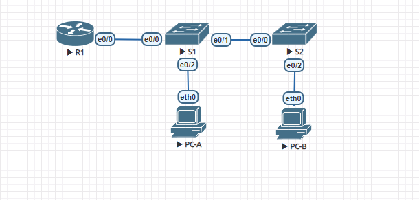
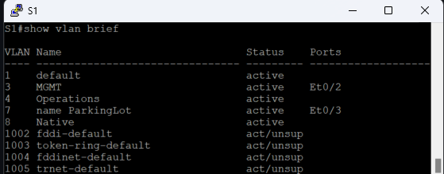
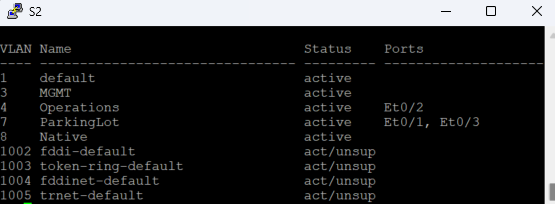
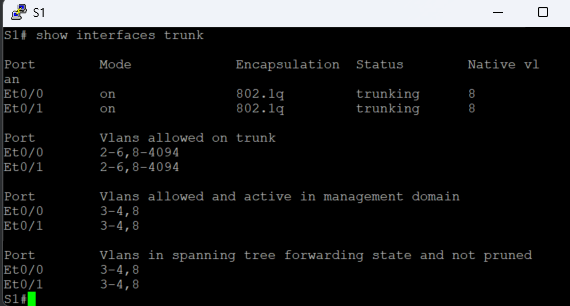
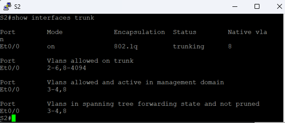
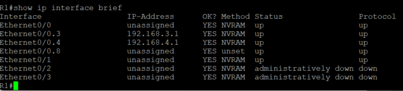
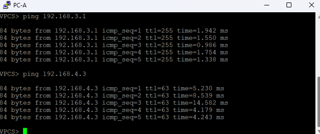
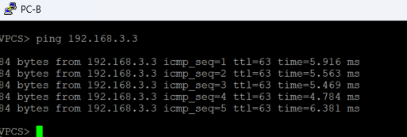

### Configure Router-on-a-Stick Inter-VLAN Routing

Добавление сетей VLAN и назначение портов.

Задание:
 - Постороить сеть в Eve-NG согласно схеме 
 - Создать VLAN согласно таблице VLAN и назначить их на интерфейсы
 - Настроить транковые порты (802.1Q) между свичами
 - Настроить Inter-VLAN Routing на роутере
 - Удостоверится в работе сети

##### Таблица адресации
Устрoйство  | Интерфейс | IP address | Subnet Mask | Default Gateway
------------- | -------------| -------------| -------------| -------------
R1  | Ethernet0/0.3 | 192.168.3.1 | 255.255.255.0 | N\A 
   | Ethernet0/0.4 | 192.168.4.1 | 255.255.255.0 | N\A 
| Ethernet0/0.8 | N\A | N\A | N\A 
S1 | VLAN 3 | 192.168.3.11  | 255.255.255.0 | 192.168.3.1
S2 | VLAN 3 | 192.168.3.12  | 255.255.255.0 | 192.168.3.1
PC-A | NIC | 192.168.3.3  | 255.255.255.0 | 192.168.3.1
PC-B | NIC | 192.168.4.3  | 255.255.255.0 | 192.168.4.1

##### Таблица VLAN
VLAN | Name | Назначенные интерфейсы 
------------- | -------------| -------------
3  | MGMT | S1: e0/2
 4  | Operations |  S2: e0/2
7| ParkingLot | All unused
8 | Native | N\A 

### Решение:
##### Создание Vlans и назначение на порты

##### Конфигурирование транковых портов

##### Конфигурирование Inter-VLAN Routing

##### Финальная проверка связанности пинг PC-A - PC-B

