### Развертывание коммутируемой сети с резервными каналами

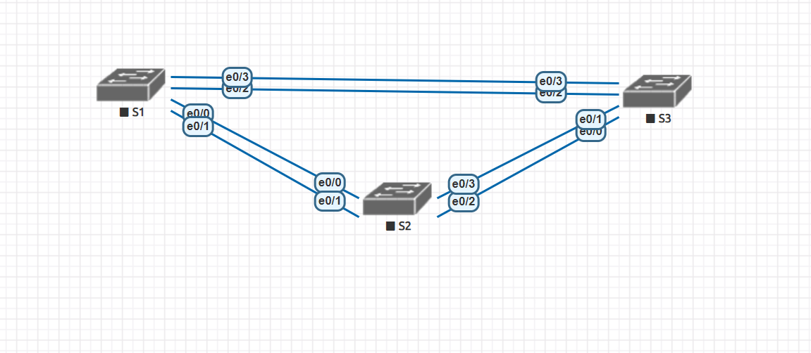

##### Таблица адресации
Устрoйство  | Интерфейс | IP address | Subnet Mask 
------------- | -------------| -------------| -------------
S1 | VLAN 1 | 192.168.1.1  | 255.255.255.0 
S2 | VLAN 1 | 192.168.1.2  | 255.255.255.0 
S3 | VLAN 1 | 192.168.1.3  | 255.255.255.0 

Задание:
 -  Создание сети и настройка основных параметров устройства
 -  Выбор корневого моста
 -  Наблюдение за процессом выбора протоколом STP порта, исходя из стоимости портов
 -  Наблюдение за процессом выбора протоколом STP порта, исходя из приоритета портов

### Решение:
##### Часть 1 - Базовая настройка 
- Создать сеть согласно топологии.
- Настройка базовых параметров каждого коммутатора.
- Проверка связанности сетевого оборудования

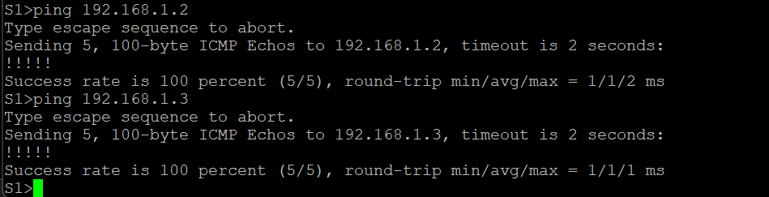

##### Часть 2 - Определение корневого свича (моста)
На всех свичах стоит приоритет по умолчанию 32769 (32768 + номер vlan)
т.к. приоритеты одинаковые, выбор Root происходит по наименьшему Mac адресу, в нашем случае это aabb.cc00.1000

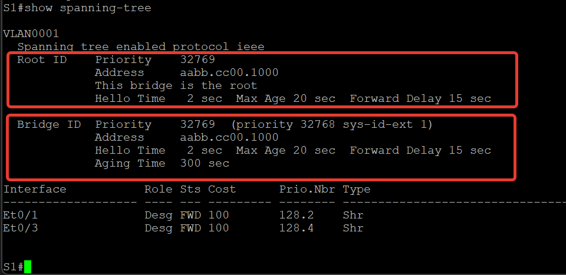
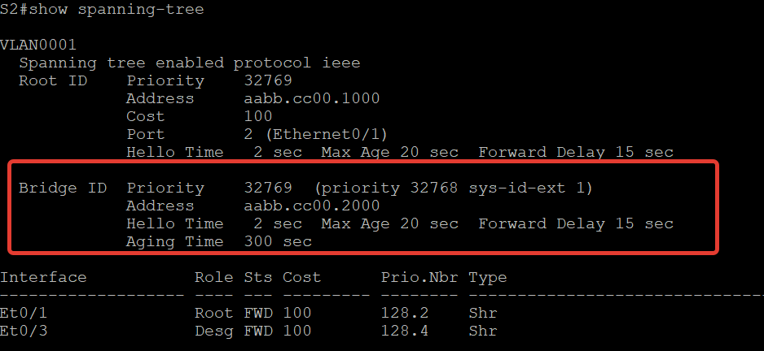
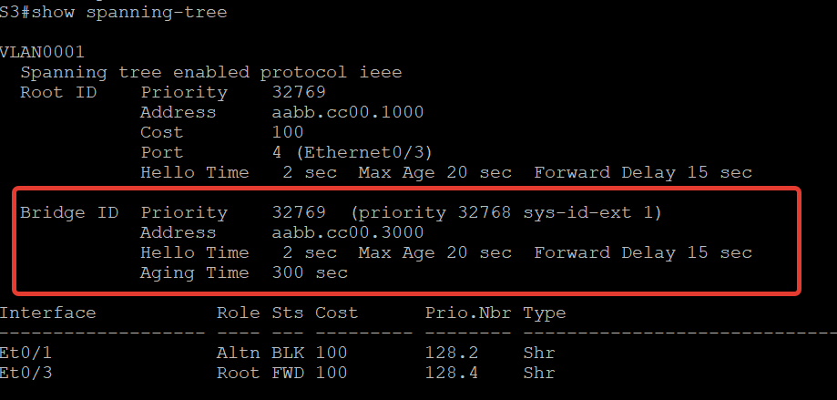

Порт e0/1 Был помечен как Altn и заблокирован, будет активирован в случае проблем с root портом.
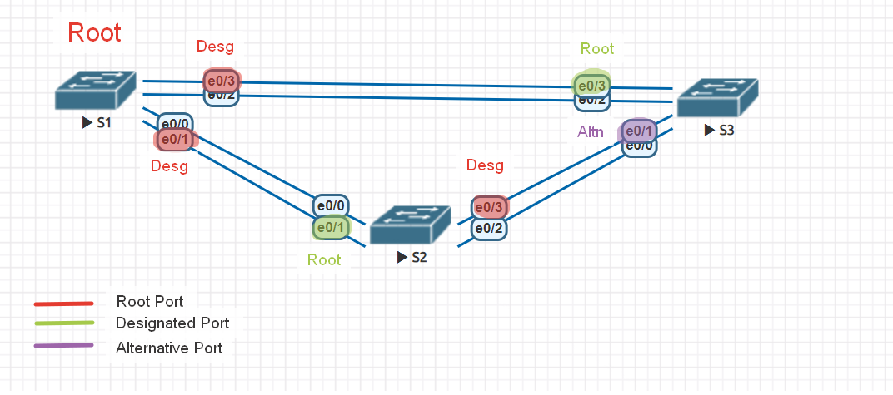

##### Часть 3 - Наблюдение за процессом выбора протоколом STP порта, исходя из стоимости портов
Протокол spanning-tree блокирует порт F0/1 на коммутаторе с самым высоким идентификатором BID (S3).

Единственным активным портом на этом коммутаторе является порт, выделенный в качестве порта Et0/3 корневого моста. Уменьшим стоимость этого порта корневого моста до 50, выполнив команду spanning-tree cost 50 режима конфигурации интерфейса

    S3(config)#int e 0/3
    S3(config-if)#spanning-tree cost 50

Проверим изменения протокола spanning-tree.

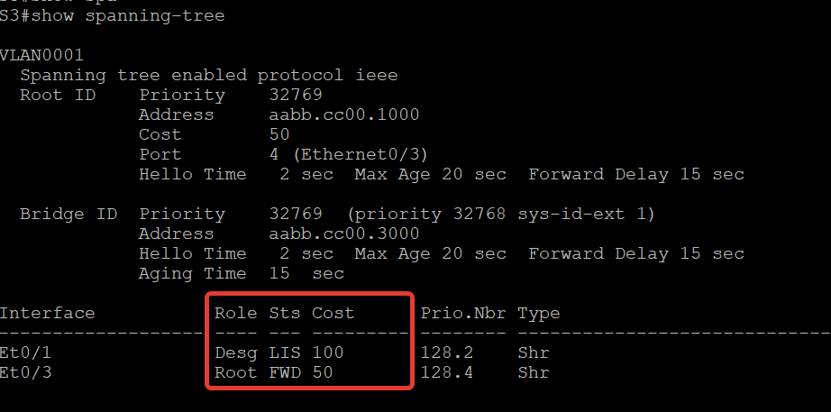

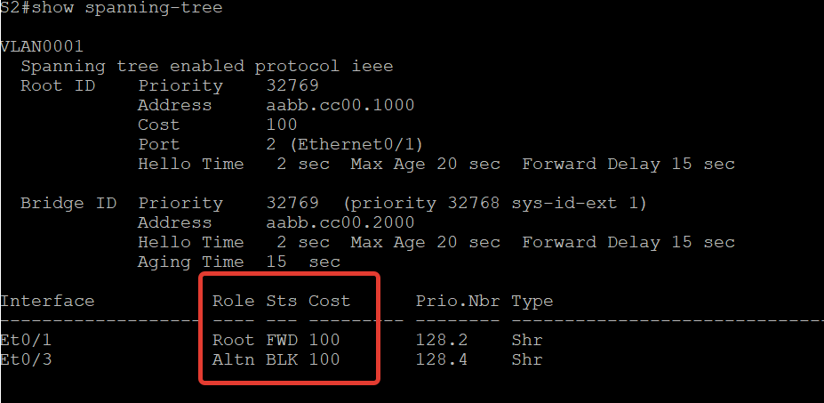

Как мы видим протокол spanning-tree заменяет ранее заблокированный порт на назначенный порт и блокирует порт, который был назначенным портом на другом коммутаторе, т.к. была изменена стоимость порта и топология была перестороина 

Вернем стоимость порта в значение по умолчанию.

    S3(config)#int e 0/3
    S3(config-if)#no spanning-tree cost

Топология перестроилась обратно 

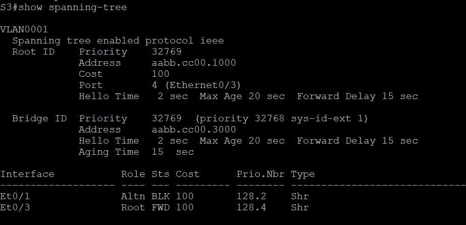

##### Часть 4 - Наблюдение за процессом выбора протоколом STP порта, исходя из приоритета портов

Требуется включить все ранее выключенные избыточные порты E0/0 и E0/2 и выполнить команду **show spanning-tree** на некорневых свичах (S2 и S3).

Порт корневого моста переместился на порт с меньшим номером, связанный с коммутатором корневого моста, и заблокировал предыдущий порт корневого моста

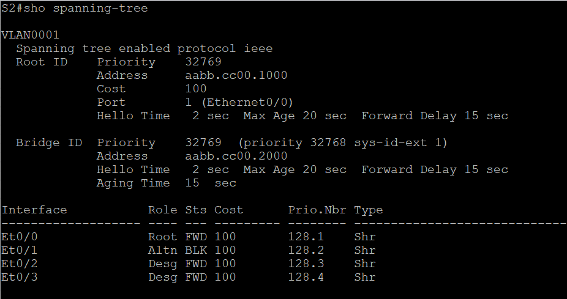

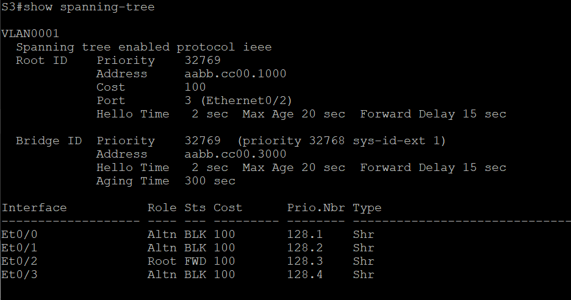
