### Внедрение и настройка DHCPv4 и DHCPv6

Задание DHCPv4
 - Постороить сеть в Eve-NG согласно схеме, таблице адресации и VLAN
 - Настроить два DHCPv4 Scope на R1
 - Настроить и проверить DHCP релей на R2
 
 Задание DHCPv6
 - Постороить сеть в Eve-NG согласно схеме, таблице адресации
 - Проверить назначение адреса SLAAC от R1
 - Настроить и проверить сервер Stateless DHCPv6 на R1
  - Настроить и проверить сервер Stateful DHCPv6 на R1
  - Настроить и проверить DHCPv6 релей на R2

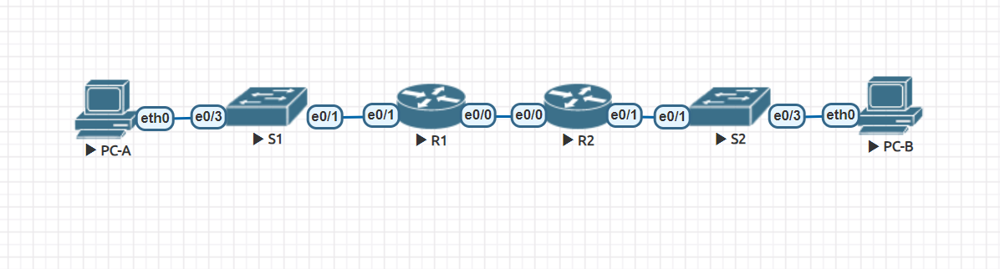

##### Таблица адресации IPv4
Устрoйство  | Интерфейс | IP address | Subnet Mask | Default Gateway
------------- | -------------| -------------| -------------| -------------
R1  | Ethernet0/0 | 10.0.0.1 | 255.255.255.252| N\A 
| | Ethernet0/1 | N\A | N\A |  
| | Ethernet0/1.100 |  |  |  
| | Ethernet0/1.200 |  |  |  
| | Ethernet0/1.1000 |N\A  | N\A  | 
R2 | Ethernet0/0 | 10.0.0.2 | 255.255.255.252 | N\A 
| | Ethernet0/1 |  | | N\A 
S1| VLAN 200 |  | | 
S2 | VLAN 1 |  |  | 
PC-A | NIC | DHCP  | DHCP | DHCP
PC-B | NIC | DHCP  | DHCP | DHCP

##### Таблица адресации IPv6
Устрoйство  | Интерфейс | IP address 
------------- | -------------| -------------
R1  | Ethernet0/0 | 2001:db8:acad:2::1/64
|| Ethernet0/0|  fe80::1 
| | Ethernet0/1.100 | 2001:db8:acad:1::1/64
| |Ethernet0/1.100|  fe80::1 
R2 | Ethernet0/0 | 2001:db8:acad:2::2/64 
|| Ethernet0/0  | fe80::2
| | Ethernet0/1| 2001:db8:acad:3::1/64
| |Ethernet0/1|  fe80::1 
PC-A | NIC | DHCP  
PC-B | NIC | DHCP  

##### Таблица VLAN
VLAN | Name | Назначенные интерфейсы 
------------- | -------------| -------------
1  | N\A  | S2: e0/3
 100  | Clients |  S1: e0/3
200| Management | S1: VLAN 200
999 | Parking Lot | S1: e0/0, e0/2
1000 | Native | N\A 

### Решение DHCPv4:
##### Step 1: Создать схему адресации для клиентов
Подсеть 192.168.1.0\24 разделить что бы удоволетворяло следкющим требованиям

- Subnet A - поддерживающая 58 клиентов на R1 (Vlan 100 - Clients)
 
   Записать в таблицу адресации 1-й адрес для интерфейса R1  Ethernet0/1.100
- Subnet B - поддерживающая 28 клиентов на R1 (Vlan 200 - Management)  

  Записать в таблицу адресации 1-й адрес для интерфейса R1  Ethernet0/1.200
  Записать в таблицу адресации 2-й адрес для интерфейса S1  Vlan200

- Subnet C - поддерживающая 12 клиентов на R2
 
   Записать в таблицу адресации 1-й адрес для интерфейса R2  Ethernet0/1

##### Предварительно составим таблицу подсетей.

Subnet | Network | Subnet Mask | Clients | First Address
------------- | -------------| -------------| --------- | -----
A  | 192.168.1.0 | 255.255.255.192 (\26) | 62 | 192.168.1.1
B  |192.168.1.64  | 255.255.255.224 (\27)| 30| 192.168.1.65
C  | 192.168.1.96  | 255.255.255.240 (\28)| 14 | 192.168.1.97

##### Обновим таблицу адресации IPv4

Устрoйство  | Интерфейс | IP address | Subnet Mask | Default Gateway
------------- | -------------| -------------| -------------| -------------
R1  | Ethernet0/0 | 10.0.0.1 | 255.255.255.252| N\A 
| | Ethernet0/1 | N\A | N\A |  
| | Ethernet0/1.100 |  192.168.1.1  | 255.255.255.192 |  
| | Ethernet0/1.200 | 192.168.1.65 | 255.255.255.224 |  
| | Ethernet0/1.1000 |N\A  | N\A  | 
R2 | Ethernet0/0 | 10.0.0.2 | 255.255.255.252 | N\A 
| | Ethernet0/1 | 192.168.1.97 | 255.255.255.240 | N\A 
S1| VLAN 200 | 192.168.1.66 | 255.255.255.224 | 192.168.1.65
S2 | VLAN 1 | 192.168.1.98 | 255.255.255.240 | 192.168.1.97
PC-A | NIC | DHCP  | DHCP | DHCP
PC-B | NIC | DHCP  | DHCP | DHCP

##### Step 2: Настроить Inter-VLAN Routing на R1 и R2
Настройки L3 роутера R1 согласно таблице адресации
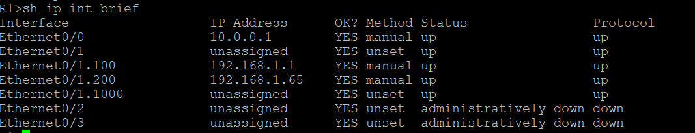

Настройки L3 роутера R2 согласно таблице адресации
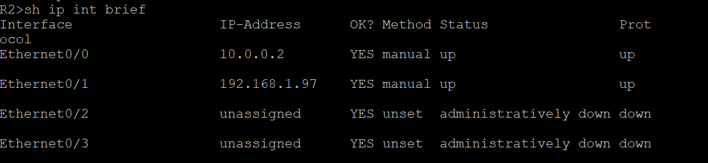

На роутерах добавляем маршрут по умолчанию

Для R1

     ip route 0.0.0.0 0.0.0.0 10.0.0.2

Для R2

      ip route 0.0.0.0 0.0.0.0 10.0.0.1

Проверяем связанность
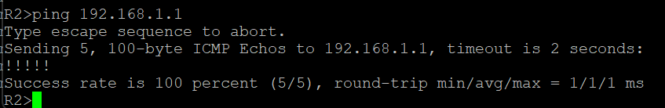

##### Step 3: Настроить свичи S1 и S2
Добавление Vlan на S1 согласно таблице и настройка портов

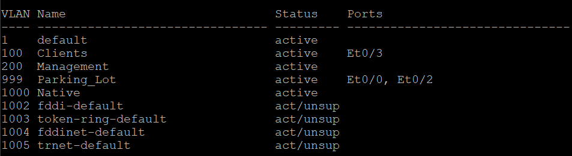

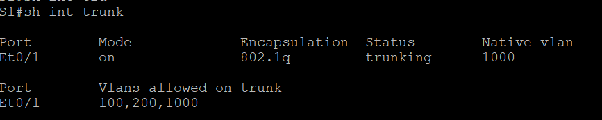

##### Step 4: Настроить DHCPv4 пул на R1, для 2х подсетей A и С
Требуется исключить первые 5 адресов из выдачи в каждом пуле

    ip dhcp excluded-address 192.168.1.1 192.168.1.5
    ip dhcp excluded-address 192.168.1.97 192.168.1.101

После настройки пула, нужно проверть конфигурацию.

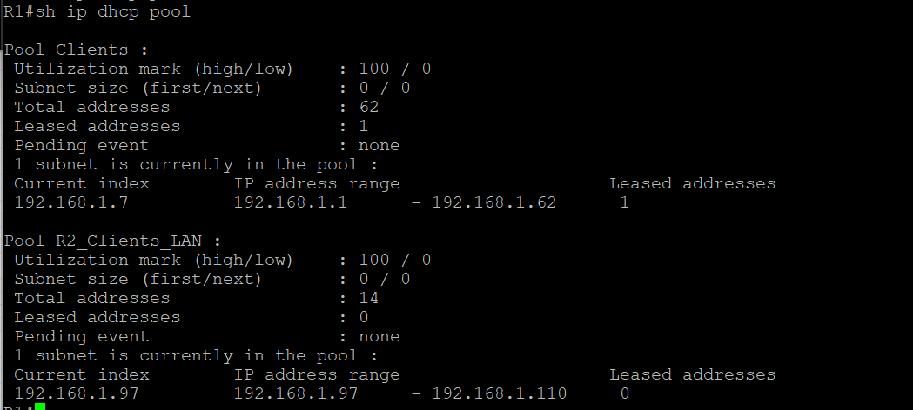

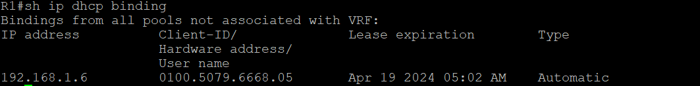

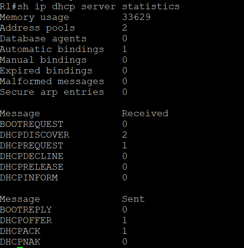

Проверка Получение IP по DHCP на PC-A 

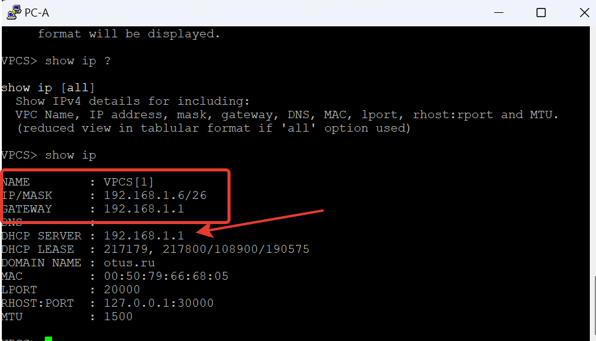

##### Step 5: Настроить DHCP Relay на R2
Настрока DHCP Relay включется на интерфейсе смотрящго в сторону S2 и PC-B, в нашемм случае это интерфейс Ethernet 0/1, в качестве Relay указываем IP R1, на котором уже настроен пул

    int e 0/1
    ip helper-address 10.0.0.1

Проверем получение IP на PC-B
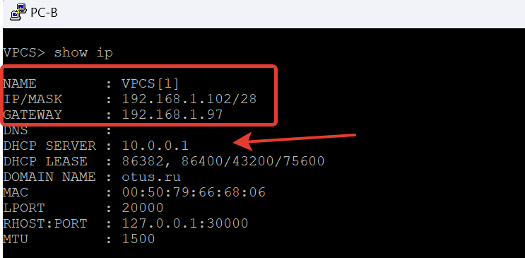

Проверяем статистику DHCP пулов на R1
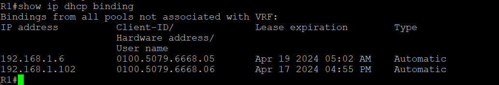

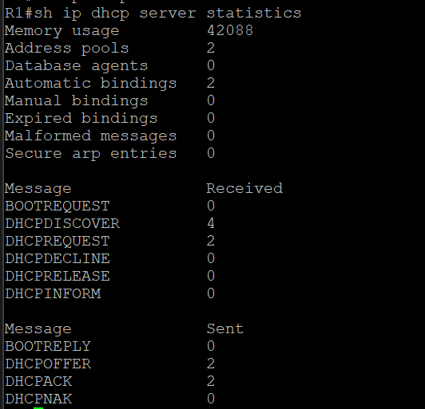

Финальная проверка, с PC-A проверям доступность PC-B

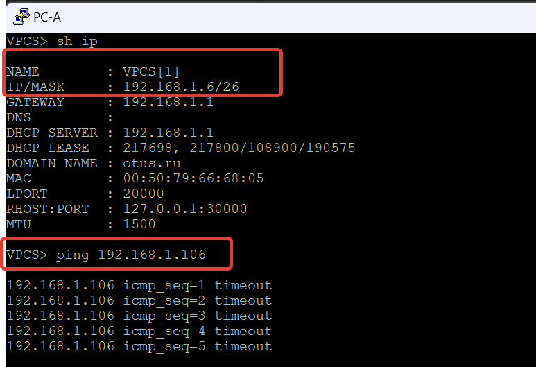

#### Настрйка DHCPv6
##### Step 6: Настроить интерфейсы и роутинга на маршрутизаторах
На R1 и R2 на интефейсах настроить IPv6 адреса согласно таблице адресации.
Потом следует включить маршрутизацию IPv6 и на каждом роутере  настроить Default route

R1:

    ipv6 unicast-routing
    ipv6 route ::/0 2001:db8:acad:2::2

R2:

    ipv6 unicast-routing 
    ipv6 route ::/0 2001:db8:acad:2::1

Посмотреть\проверить назначенные IPv6 адреса можно командой

    sh ipv6 interface brief

Проверить маршрутизацию с R1 пингуем R2
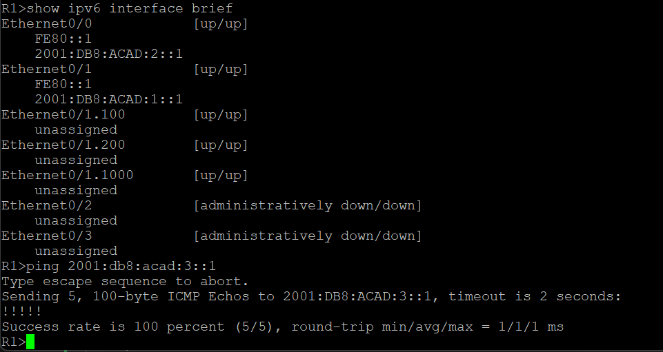

##### Step 7: Проверить работу SLAAC на R1
Проверям настройки Router Advertisement, сейчас включен флаг A
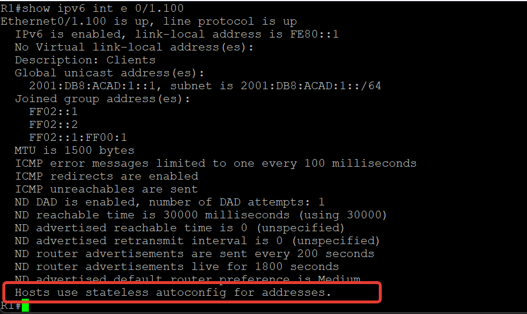
Проверяем какой  IP получил PC-A
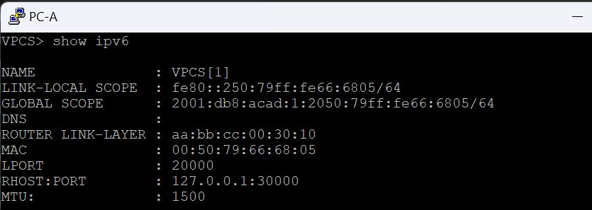

##### Step 8: Настроить на R1 DHCPv6 stateless на выдачу DNS и Domain information
На R1 создаем DHCPv6 pool c настройками  DNS и Domain information

    ipv6 dhcp pool R1-Stateless
    dns-server 2001:db8:acad::254
    domain-name otus.ru

Назначаем pool на интерфейс где будут радаватся настройки и включаем флаг O 

    int e 0/1.100
    ipv6 nd other-config-flag
    ipv6 dhcp server R1-Stateless

Проверяем настройки на нтерфейсе
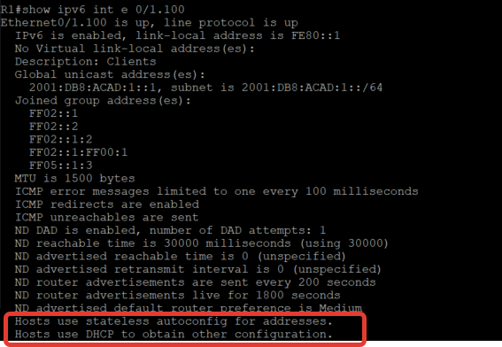

Проверяем результат на PC-A

##### Step 9: Настройка DHCPv6 stateful на R1