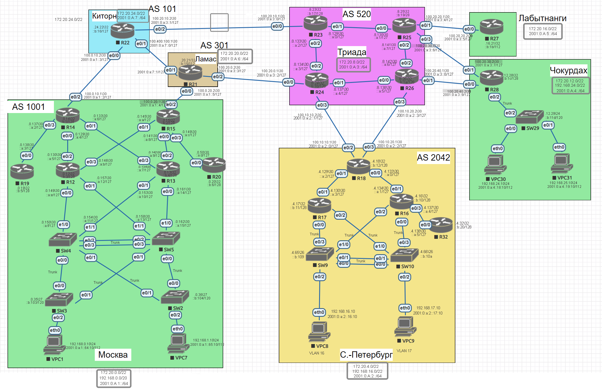

# Архитектура сети 

1.  Разработаете и задокументируете адресное пространство для лабораторного стенда.
2. Настроите ip адреса на каждом активном порту
3. Настроите каждый VPC в каждом офисе в своем VLAN.
4. Настроите VLAN/Loopbackup interface управления для сетевых устройств
5. Настроите сети офисов так, чтобы не возникало broadcast штормов, а использование линков было максимально оптимизировано
6. Используете IPv4. IPv6 по желанию

Для удобства в качестве стыковочных подсетей между площадками будем использовать подсеть 100.0.0.0\8

Для клиентских подсетей всех офисов будем использовать подсеть 192.168.0.0\16 с дробление на более маленькие подсети, для всех филиалов будем использовать маску \22, для головного подразделения  маску \20
Для *Management*  целей, включая сетевое оборудование будем использовать подсеть 172.20.0.0\16 с дроблением по филиалам с маской \22

Для удобства в качестве стыковочных подсетей между площадками будем использовать подсеть 100.100.0.0\16

1. Суммарное адресное пространство

| Город           | IPv4  summary   | IPv6 summary    |
| --------------- | --------------- | --------------- |
| Москва          | 172.20.0.0/22   | 2001:0:A:1::/64 |
|                 | 192.168.0.0/20  |                 |
| Санкт-Петербург | 172.20.4.0/22   | 2001:0:A:2::/64 |
|                 | 192.168.16.0/22 |                 |
| Триада          | 172.20.8.0/22   | 2001:0:A:3::/64 |
|                 | 192.168.20.0/22 |                 |
| Чокурдах        | 172.20.12.0/22  | 2001:0:A:4::/64 |
|                 | 192.168.24.0/22 |                 |
| Лабытнанги      | 172.20.16.0/22  | 2001:0:A:5::/64 |
|                 | 192.168.28.0/22 |                 |
| Ламас           | 172.20.20.0/22  | 2001:0:A:6::/64 |
|                 | 192.168.32.0/22 |                 |
| Киторн          | 172.20.24.0/22  | 2001:0:A:7::/64 |
|                 | 192.168.36.0/22 |                 |

2.  IP адресация на каждом активном порту

### Москва

2001:0:a:1::/112 - external Office

2001:0:a:1::a:0/112 

2001:0:a:1::b:0/112 - mgmt and vlan 1000

- 2001:0:a:1::b:0/120 - под  loopback
- 2001:0:a:1::b:100/120 - под vlan 1000

2001:0:a:1::64:0/112 - vlan 100

2001:0:a:1::65:0/112 - vlan 101

#### Описание подсетей

| 2001:0:A:1::/64 |                      |                       |                                     |
| --------------- | -------------------- | --------------------- | ----------------------------------- |
|                 | 2001:0:a:1::/112     |                       | external office                     |
|                 | 2001:0:a:1::a:0/112  |                       | стыковочные подсети маршрутизаторов |
|                 | 2001:0:a:1::b:0/112  |                       |                                     |
|                 |                      | 2001:0:a:1::b:0/120   | loopback                            |
|                 |                      | 2001:0:a:1::b:100/120 | vlan 1000 (mgmt)                    |
|                 | 2001:0:a:1::64:0/112 |                       | vlan 100                            |
|                 | 2001:0:a:1::65:0/112 |                       | vlan 101                            |
| 192.168.0.0/20  |                      |                       |                                     |
|                 | 192.168.0.0\24       |                       | vlan 100                            |
|                 | 192.168.1.0\24       |                       | vlan 101                            |
| 172.20.0.0/22   |                      |                       |                                     |
|                 | 172.20.04.0\24       |                       |                                     |
|                 |                      | 172.20.0.0/27         | loopback                            |
|                 |                      | 172.20.0.32/27        | vlan 1000 (mgmt)                    |
|                 |                      | 172.20.0.128/25       | стыковочные подсети маршрутизаторов |
|100.100.0.0\16   |                      |                       | external office                     |

#### IP адресация

| Device | Port    | IPv4             | IPv6                  | IPv6 link-local |            |
| ------ | ------- | ---------------- | --------------------- | --------------- | ---------- |
| R14    |         | 172.20.0.14\32   | 2001:0:a:1::b:1/128   |                 |            |
|        | e0/0    | 172.20.0.129\30  | 2001:0:a:1::a:4/127   | fe80::e         | to_R12     |
|        | e0/1    | 172.20.0.133\30  | 2001:0:a:1::a:6/127   | fe80::e         | to_R13     |
|        | e0/2    | 100.100.100.1\30 | 2001:0:a:1::2/127     | fe80::e         | to_Kitoron |
|        | e0/3    | 172.20.0.137\30  | 2001:0:a:1::a:2/127   | fe80::e         | to_R19     |
| R15    |         | 172.20.0.15\32   | 2001:0:a:1::b:2/128   |                 |            |
|        | e0/0    | 172.20.0.141\30  | 2001:0:a:1::a:8/127   | fe80::f         | to_R13     |
|        | e0/1    | 172.20.0.145\30  | 2001:0:a:1::a:a/127   | fe80::f         | to_R12     |
|        | e0/2    | 100.100.200.1\30 | 2001:0:a:1::4/127     | fe80::f         | to_Lamas   |
|        | e0/3    | 172.20.0.149\30  | 2001:0:a:1::a:c/127   | fe80::f         | to_R20     |
| R12    |         | 172.20.0.12\32   | 2001:0:a:1::b:3/128   |                 |            |
|        | e0/0    | 172.20.0.149\30  | 2001:0:a:1::a:e/127   | fe80::b         | to_SW4     |
|        | e0/1    | 172.20.0.157\30  | 2001:0:a:1::a:12/127  | fe80::b         | to_SW5     |
|        | e0/2    | 172.20.0.130\30  | 2001:0:a:1::a:5/127   | fe80::b         | to_R14     |
|        | e0/3    | 172.20.0.146\30  | 2001:0:a:1::a:b/127   | fe80::b         | to_R15     |
| R13    |         | 172.20.0.13\32   | 2001:0:a:1::b:4/128   |                 |            |
|        | e0/0    | 172.20.0.161\30  | 2001:0:a:1::a:14/127  | fe80::c         | to_SW5     |
|        | e0/1    | 172.20.0.153\30  | 2001:0:a:1::a:10/127  | fe80::c         | to_SW4     |
|        | e0/2    | 172.20.0.142\30  | 2001:0:a:1::a:9/127   | fe80::c         | to_R15     |
|        | e0/3    | 172.20.0.134\30  | 2001:0:a:1::a:7/127   | fe80::c         | to_R14     |
| R19    |         | 172.20.0.19\32   | 2001:0:a:1::b:5/128   |                 |            |
|        | e0/0    | 172.20.0.138\30  | 2001:0:a:1::a:3/127   | fe80::13        | to_R14     |
| R20    |         | 172.20.0.20\32   | 2001:0:a:1::b:6/128   |                 |            |
|        | e0/0    | 172.20.0.50\30   | 2001:0:a:1::a:d/127   | fe80::14        | to_R15     |
| SW4    |         | 172.20.0.33\27   | 2001:0:a:1::b:104/120 |                 | vlan 1000  |
|        | e1/0    | 172.20.0.150\30  | 2001:0:a:1::a:f/127   | fe80::4         | to_R12     |
|        | e1/1    | 172.20.0.154\30  | 2001:0:a:1::a:11/127  | fe80::4         |            |
|        | vlan100 | 192.168.0.2      | 2001:0:a:1::64:2/112  |                 | glbp       |
|        | vlan101 | 192.168.1.2      | 2001:0:a:1::65:2/112  |                 | glbp       |
| SW5    |         | 172.20.0.34\27   | 2001:0:a:1::b:105/120 |                 | vlan 1000  |
|        | e1/1    | 172.20.0.158\30  | 2001:0:a:1::a:13/127  | fe80::5         | to_R12     |
|        | e1/0    | 172.20.0.162\30  | 2001:0:a:1::a:15/127  | fe80::5         | to_R13     |
|        | vlan100 | 192.168.0.3      | 2001:0:a:1::64:3/112  |                 | glbp       |
|        | vlan101 | 192.168.1.3      | 2001:0:a:1::65:3/112  |                 | glbp       |
| SW3    |         | 172.20.0.35\27   | 2001:0:a:1::b:103/120 |                 | vlan 1000  |
| SW2    |         | 172.20.0.36\27   | 2001:0:a:1::b:104/120 |                 | vlan 1000  |
| vpc1   | eth0    | 192.168.0.10\24  | 2001:0:a:1::64:10/112 | fe80::1         | to_SW3     |
| vpc7   | eth0    | 192.168.1.10\24  | 2001:0:a:1::65:10/112 | fe80::7         | to_SW2     |

### Санкт-Петербург

#### Описание подсетей

| 2001:0:A:2::/64 |                      |                       |                                     |
| --------------- | -------------------- | --------------------- | ----------------------------------- |
|                 | 2001:0:a:2::/112     |                       | external office                     |
|                 | 2001:0:a:2::a:0/112  |                       | стыковочные подсети маршрутизаторов |
|                 | 2001:0:a:2::b:0/112  |                       |                                     |
|                 |                      | 2001:0:a:2::b:0/120   | loopback                            |
|                 |                      | 2001:0:a:2::b:100/120 | vlan 1000 (mgmt)                    |
|                 | 2001:0:a:2::16:0/112 |                       | vlan 16                             |
|                 | 2001:0:a:2::17:0/112 |                       | vlan 17                             |
| 192.168.16.0/22 |                      |                       |                                     |
|                 | 192.168.16.0\24      |                       | vlan 16                             |
|                 | 192.168.17.0\24      |                       | vlan 17                             |
| 172.20.4.0/22   |                      |                       |                                     |
|                 | 172.20.4.0\24        |                       |                                     |
|                 |                      | 172.20.4.0/27         | loopback                            |
|                 |                      | 172.20.4.32/27        | vlan 1000 (mgmt)                    |
|                 |                      | 172.20.4.128/25       | стыковочные подсети маршрутизаторов |
|100.200.0.0\16   |                      |                       | external office                     |

#### IP адресация

| Device | Port   | IPv4             | IPv6                  | IPv6 link-local |               |
| ------ | ------ | ---------------- | --------------------- | --------------- | ------------- |
| R18    |        | 172.20.4.18\32   | 2001:0:a:2::b:12/128  |                 |               |
|        | e0/0   | 172.20.4.133\30  | 2001:0:a:2::a:0/127   | fe80::12        | to_R16        |
|        | e0/1   | 172.20.4.129\30  | 2001:0:a:2::a:2/127   | fe80::12        | to_R17        |
|        | e0/2   | 100.200.100.1\30 | 2001:0:a:2::0/127     | fe80::12        | to_Triada_R24 |
|        | e0/3   | 100.200.200.1\30 | 2001:0:a:2::2/127     | fe80::12        | to_Triada_R26 |
| R17    |        | 172.20.4.17\32   | 2001:0:a:2::b:11/128  |                 |               |
|        | e0/1   | 172.20.4.130\30  | 2001:0:a:2::a:3/127   | fe80::11        | to_R18        |
|        | vlan16 | 192.168.16.3     | 2001:0:a:2::16:2/112  |                 | vrrp IP       |
|        | vlan17 | 192.168.17.3     | 2001:0:a:2::17:3/112  |                 | vrrp IP       |
| R16    |        | 172.20.4.16\32   | 2001:0:a:2::b:10/128  |                 |               |
|        | e0/1   | 172.20.4.134\30  | 2001:0:a:2::a:1/127   | to_R18          |               |
|        | e0/3   | 172.20.4.137\30  | 2001:0:a:2::a:4/127   | to_R32          |               |
|        | vlan16 | 192.168.16.2     | 2001:0:a:2::16:2/112  | vrrp IP         |               |
|        | vlan17 | 192.168.17.2     | 2001:0:a:2::17:2/112  | vrrp IP         |               |
| R32    |        | 172.20.4.32\32   | 2001:0:a:2::b:20/128  |                 |               |
|        | e0/0   | 172.20.4.138\30  | 2001:0:a:2::a:5/127   | to_R16          |               |
| SW9    |        | 172.20.4.65\26   | 2001:0:a:2::b:109/120 |                 | vlan 1000     |
| SW10   |        | 172.20.4.66\26   | 2001:0:a:2::b:10a/120   |                 | vlan 1000     |
| vpc8   | eth0   | 192.168.16.10\24 | 2001:0:a:2::16:10/112 | fe80::8         | to_SW9        |
| vpc9   | eth0   | 192.168.17.10\24 | 2001:0:a:2::17:10/112 | fe80::19        | to_SW10       |

### Триада

#### Описание подсетей

| 2001:0:A:3::/64 |                     |                 |                                     |
| --------------- | ------------------- | --------------- | ----------------------------------- |
|                 | 2001:0:a:3::/112    |                 | external office                     |
|                 | 2001:0:a:3::a:0/112 |                 | loopback                            |
|                 | 2001:0:a:3::b:0/112 |                 | стыковочные подсети маршрутизаторов |
| 172.20.8.0\22   |                     |                 |                                     |
|                 | 172.20.8.0/24       |                 |                                     |
|                 |                     | 172.20.8.0\26   | loopback                            |
|                 |                     | 172.20.8.128\26 | стыковочные подсети маршрутизаторов |
| 100.300.0.0/16  |                     |                 | external office                     |

#### IP адресация

| Device | Port | IPv4             | IPv6                 | IPv6 link-local |               |
| ------ | ---- | ---------------- | -------------------- | --------------- | ------------- |
| R23    |      | 172.20.8.23\32   | 2001:0:a:3::b:17/128 | fe80::17        |               |
|        | e0/0 | 100.300.100.1\30 | 2001:0:a:3::0/127    | fe80::17        | to_Kitorn     |
|        | e0/1 | 172.20.8.129\30  | 2001:0:a:3::a:0/127  | fe80::17        | to_R25        |
|        | e0/2 | 172.20.8.133\30  | 2001:0:a:3::a:2/127  |                 | to_R24        |
| R24    |      | 172.20.8.24\32   | 2001:0:a:3::b:18/128 | fe80::18        |               |
|        | e0/0 | 100.300.200.1\30 | 2001:0:a:3::2/127    | fe80::18        | to_Lamas      |
|        | e0/1 | 172.20.8.137\30  | 2001:0:a:3::a:4/127  | fe80::18        | to_R26        |
|        | e0/2 | 172.20.8.134\30  | 2001:0:a:3::a:3/127  | fe80::18        | to_R23        |
|        | e0/3 | 100.200.100.2\30 | 2001:0:a:2::1/127    | fe80::18        | to_SpB        |
| R25    |      | 172.20.8.25\32   | 2001:0:a:3::b:19/28  | fe80::19        |               |
|        | e0/0 | 172.20.8.130\30  | 2001:0:a:3::a:1/127  | fe80::19        | to_R23        |
|        | e0/1 | 100.300.300.1\30 | 2001:0:a:3::4/127    | fe80::19        | to_Labytnangi |
|        | e0/2 | 172.20.8.141\30  | 2001:0:a:3::a:7/127  | fe80::19        | to_R26        |
|        | e0/3 | 100.300.400.1\30 | 2001:0:a:3::6/127    | fe80::19        | to_Chokurdakh |
| R26    |      | 172.20.8.26\32   | 2001:0:a:3::b:1a/128 | fe80::1a        |               |
|        | e0/0 | 172.20.8.138\30  | 2001:0:a:3::a:5/127   | fe80::1a        | to_R24        |
|        | e0/1 | 100.300.500.1\30 | 2001:0:a:3::8/127    | fe80::1a        | to_Chokurdakh |
|        | e0/2 | 172.20.8.142\30  | 2001:0:a:3::a:6/127  | fe80::1a        | to_R25        |
|        | e0/3 | 100.200.200.2\30 | 2001:0:a:2::3/127    | fe80::1a        | to_SpB        |

### Чокурдах

#### Описание подсетей

| 2001:0:A:4::/64 |                      |     |                  |
| --------------- | -------------------- | --- | ---------------- |
|                 | 2001:0:a:4::b:0/112  |     | vlan 1000 (mgmt) |
|                 | 2001:0:a:4::18:0/112 |     | vlan 24          |
|                 | 2001:0:a:4::19:0/112 |     | vlan 25          |
| 172.20.12.0\22  |                      |     |                  |
|                 | 172.20.12.0\24       |     | vlan 1000 (mgmt) |
| 192.168.24.0\22 |                      |     |                  |
|                 | 192.168.24.0\24      |     | vlan 24          |
|                 | 192.168.25.0\24      |     | vlan 25          |

#### IP адресация

| Device | Port      | IPv4             | IPv6                  | IPv6 link-local |               |
| ------ | --------- | ---------------- | --------------------- | --------------- | ------------- |
| R28    |           | 172.20.12.28\32  | 2001:0:a:4::b:1c/128  | fe80::1c        |               |
|        | e0/0      | 100.300.400.2\30 | 2001:0:a:3::9/127     | fe80::1c        | to_Triada     |
|        | e0/1      | 100.300.400.2\30 | 2001:0:a:3::7/127     | fe80::1c        | to_Triada     |
|        | e0/2.1000 | 172.20.12.1\24   | 2001:0:a:4::b:1/112   | fe80::1c        | gw vlan  1000 |
|        | e0/2.24   | 192.168.24.1\24  | 2001:0:a:4::18:1/112  | fe80::1c        | gw vlan  24   |
|        | e0/2.25   | 192.168.25.1\24  | 2001:0:a:4::19:1/112  | fe80::1c        | gw vlan  25   |
| SW29   |           | 172.20.12.29\24  | 2001:0:a:4::b:11d/120 | fe80::1d        | vlan 1000     |
| vPC30  | eth0      | 192.168.24.10\24 | 2001:0:a:4::18:10/112 | fe80::30        | to_SW29       |
| vPC31  | eth0      | 192.168.25.10\24 | 2001:0:a:4::19:10/112 | fe80::30        | to_SW29       |

### Киторн

#### Описание подсетей

| 2001:0:A:7::/64 |                      |     |                  |
| --------------- | -------------------- | --- | ---------------- |
|                 | 2001:0:a:7::b:0/112  |     |  mgmt |
| 172.20.24.0\22  |                      |     |                  |
|                 | 172.20.24.0\24       |     | mgmt |

#### IP адресация

| Device | Port | IPv4             | IPv6                 | IPv6 link-local |           |
| ------ | ---- | ---------------- | -------------------- | --------------- | --------- |
| R22    |      | 172.20.24.22\32  | 2001:0:a:7::b:16/127 | fe80::18        |           |
|        | e0/0 | 100.100.100.2\30 | 2001:0:a:1::3/127    | fe80::18        | to_Moscow |
|        | e0/1 | 100.400.100.1\30 | 2001:0:a:7::0/127    | fe80::18        | to_Lamas  |
|        | e0/2 | 100.300.100.2\30 | 2001:0:a:3::1/127    | fe80::18        | to_Triada |

### Ламас

#### Описание подсетей

| 2001:0:A:6::/64 |                      |     |                  |
| --------------- | -------------------- | --- | ---------------- |
|                 | 2001:0:a:6::b:0/112  |     |  mgmt |
| 172.20.20.0\22  |                      |     |                  |
|                 | 172.20.20.0\24       |     | mgmt |

#### IP адресация

| Device | Port | IPv4             | IPv6                 | IPv6 link-local |            |
| ------ | ---- | ---------------- | -------------------- | --------------- | ---------- |
| R21    |      | 172.20.20.21/32  | 2001:0:a:6::b:15/112 | fe80::15        |            |
|        | e0/0 | 100.100.200.2/30 | 2001:0:a:1::5/127    | fe80::15        | to_Moscow  |
|        | e0/1 | 100.400.100.2/30 | 2001:0:a:7::1/127    |                 | to_Kitoron |
|        | e0/2 | 100.300.200.2/30 | 2001:0:a:3::3/127    | fe80::15        | to_Triada  |

### Лабытнанги

#### Описание подсетей

| 2001:0:A:5::/64 |                      |     |                  |
| --------------- | -------------------- | --- | ---------------- |
|                 | 2001:0:a:5::b:0/112  |     |  mgmt |
| 172.20.16.0\22  |                      |     |                  |
|                 | 172.20.16.0\24       |     | mgmt |

#### IP адресация

| Device | Port | IPv4             | IPv6                 | IPv6 link-local |           |
| ------ | ---- | ---------------- | -------------------- | --------------- | --------- |
| R27    |      | 172.20.16.21/32  | 2001:0:a:5::b:1b/112 | fe80::1b        |           |
|        | e0/0 | 100.300.300.2/30 | 2001:0:a:3::5/127    | fe80::1b        | to_Triada |
|        |      |                  |                      |                 |           |

