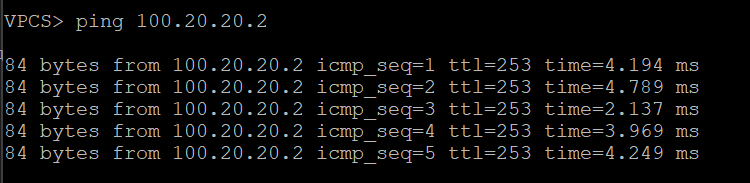
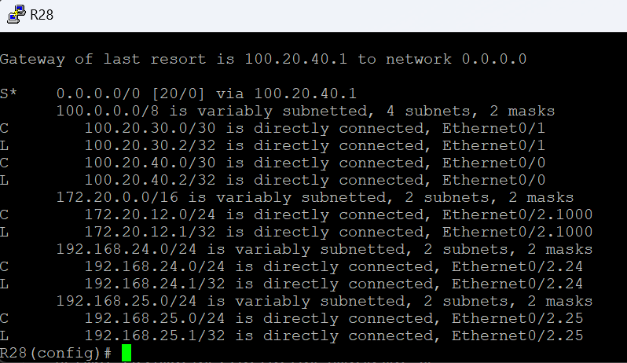
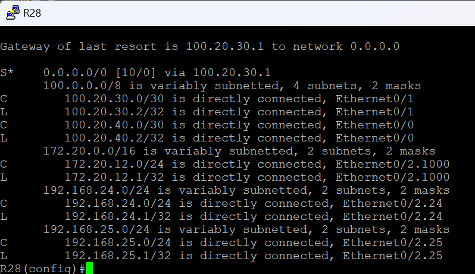
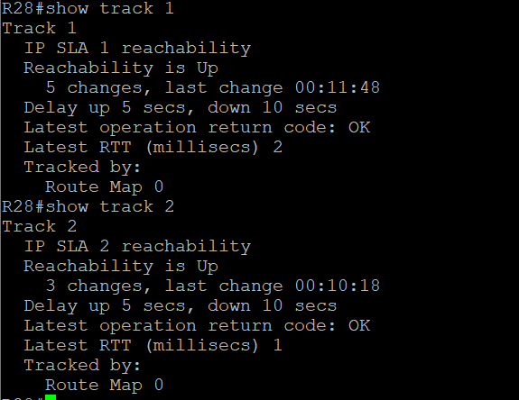
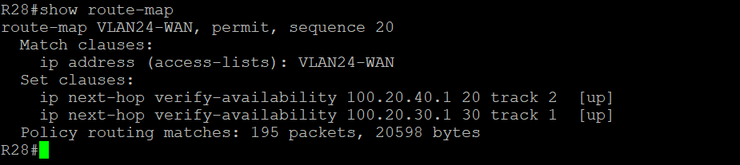
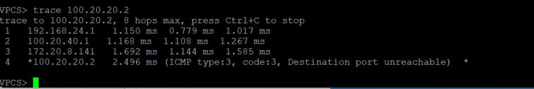
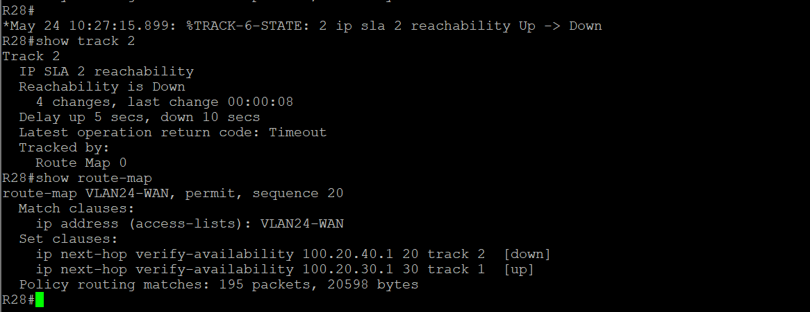
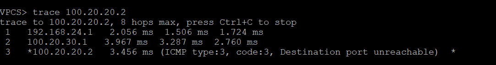

### Маршрутизация на основе политик (PBR) 

Настроить политику маршрутизации в офисе Чокурдах
Распределить трафик между 2 линками

Описание/Пошаговая инструкция выполнения домашнего задания:
В этой самостоятельной работе мы ожидаем, что вы самостоятельно:

Настроите политику маршрутизации для сетей офиса.

Распределите трафик между двумя линками с провайдером.

Настроите отслеживание линка через технологию IP SLA.(только для IPv4)

Настройте для офиса Лабытнанги маршрут по-умолчанию.

План работы и изменения зафиксированы в документации .

#### Настройка Static Route 

т.к. у нас еще не настроена динамическая маршрутизация, дастроем связанность офисов Чокурдах и Лабытнанги через статические маршруты

**R28** (Чокурдах)

     ip route 0.0.0.0 0.0.0.0 100.20.40.1 20  
     ip route 0.0.0.0 0.0.0.0 100.20.30.1 30 

**R27** (Лабытнанги)

     ip route 0.0.0.0 0.0.0.0 100.20.20.1  

**R25** (Триада)

    ip route 192.168.24.0 255.255.255.0 100.20.30.2 50

**R26** (Триада)

    ip route 100.20.20.0 255.255.255.252 172.20.8.141
    ip route 192.168.24.0 255.255.255.0 100.20.40.2 50
Проверяем доступность Лабытнанги 100.20.20.2 с VPC30 (192.168.24.10)

Меняем метрику на R28 проверям доступность через R25

#### Настройка PBR и SLA

Создаем ACL на R28 для vlan 24

     ip access-list standard VLAN24-WAN
     permit 192.168.24.0 0.0.0.255
     deny   any

Создаем SLA для отследивания состояния интервесов роутеров провайдер

    ip sla 1
    icmp-echo 100.20.30.1 source-ip 100.20.30.2
    frequency 10
    ip sla schedule 1 life forever start-time now

    ip sla 2
    icmp-echo 100.20.40.1 source-ip 100.20.40.2
    frequency 10
    ip sla schedule 1 life forever start-time now

Создаем треки 

    track 1 ip sla 1 reachability
    delay down 10 up 5

    track 2 ip sla 2 reachability
    delay down 10 up 5

Создаем PBR

    route-map VLAN24-WAN permit 20
    match ip address VLAN24-WAN 
    set ip next-hop verify-availability 100.20.40.1 20 track 2
    set ip next-hop verify-availability 100.20.30.1 30 track 1

Назначаем PBR

    interface Ethernet0/2.24
    ip policy route-map VLAN24-WAN

#### Проверка

Проверяем что трафик идет через R26

Выключаем интерфес e0/1 который смотрим на R28
Проверям что отработали SLA и Track

Проверяем доступность Лабытнанги через R25

