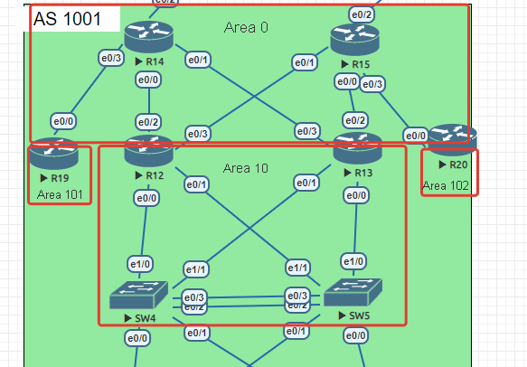
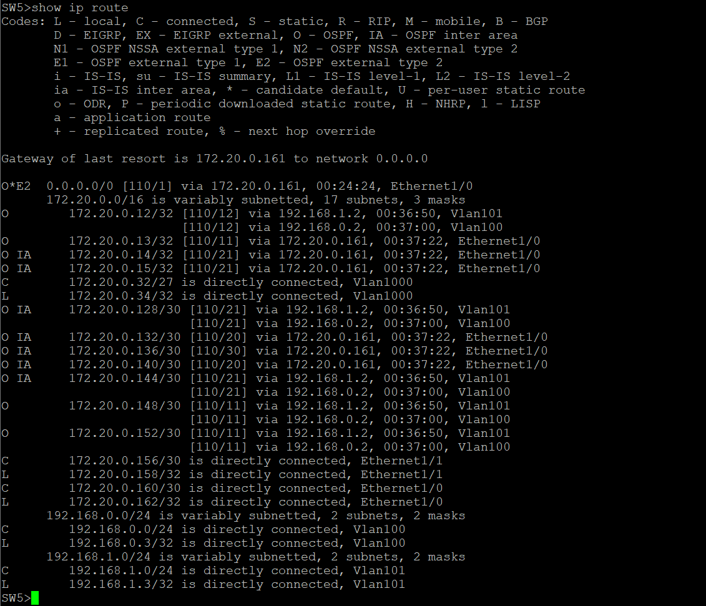
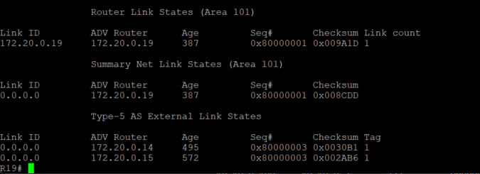

### OSPF

#### Цель:
Настроить OSPF офисе Москва
Разделить сеть на зоны
Настроить фильтрацию между зонами

#### Описание/Пошаговая инструкция выполнения домашнего задания:
- Маршрутизаторы R14-R15 находятся в зоне 0 - backbone.
- Маршрутизаторы R12-R13 находятся в зоне 10. Дополнительно к маршрутам должны получать маршрут по умолчанию.
- Маршрутизатор R19 находится в зоне 101 и получает только маршрут по умолчанию.
- Маршрутизатор R20 находится в зоне 102 и получает все маршруты, кроме маршрутов до сетей зоны 101.
- Настройка для IPv6 повторяет логику IPv4.

1) Маршрутизаторы R14-R15 находятся в зоне 0 - backbone.

Настройки OSPF на R14

    R14(config)#router ospf 1
    R14(config-router)#router-id 172.20.0.14
    R14(config-router)#passive-interface default
    R14(config-router)#no passive-interface ethernet 0/0
    R14(config-router)#no passive-interface ethernet 0/1
    R14(config-router)#no passive-interface ethernet 0/3
    R14(config-router)#exit
    R14(config)#interface Loopback0
    R14(config-if)#ip ospf 1 area 0
    R14(config-if)#interface ethernet 0/0
    R14(config-if)#ip ospf 1 area 0
    R14(config-if)#interface ethernet 0/1
    R14(config-if)#ip ospf 1 area 0
    R14(config-if)#interface ethernet 0/3
    R14(config-if)#ip ospf 1 area 0

Настройки OSPF на R15

    R15(config)#router ospf 1
    R15(config-router)#router-id 172.20.0.15
    R15(config-router)#passive-interface default
    R15(config-router)#no passive-interface ethernet 0/0
    R15(config-router)#no passive-interface ethernet 0/1
    R15(config-router)#no passive-interface ethernet 0/3
    R15(config-router)#exit
    R15(config)#interface Loopback0
    R15(config-if)#ip ospf 1 area 0
    R15(config-if)#interface ethernet 0/0
    R15(config-if)#ip ospf 1 area 0
    R15(config-if)#interface ethernet 0/1
    R15(config-if)#ip ospf 1 area 0
    R15(config-if)#interface ethernet 0/3
    R15(config-if)#ip ospf 1 area 0

2) Маршрутизаторы R12-R13 находятся в зоне 10. Дополнительно к маршрутам должны получать маршрут по умолчанию.

Настройки OSPF на R13

    R13(config)#router ospf 1
    R13(config-router)#router-id 172.20.0.13
    R13(config-router)#passive-interface default
    R13(config-router)#no passive-interface ethernet 0/0
    R13(config-router)#no passive-interface ethernet 0/1
    R13(config-router)#no passive-interface ethernet 0/2
    R13(config-router)#no passive-interface ethernet 0/3
    R13(config-router)#interface Loopback0
    R13(config-if)#ip ospf 1 area 10
    R13(config-if)#interface ethernet 0/0
    R13(config-if)#ip ospf 1 area 10
    R13(config-if)#interface ethernet 0/1
    R13(config-if)#ip ospf 1 area 10
    R13(config-if)#interface ethernet 0/2
    R13(config-if)#ip ospf 1 area 0
    R13(config-if)#interface ethernet 0/3
    R13(config-if)#ip ospf 1 area 0

    Настройки OSPF на R12

    R12(config)#router ospf 1
    R12(config-router)#router-id 172.20.0.12
    R12(config-router)#passive-interface default
    R12(config-router)#no passive-interface ethernet 0/0
    R12(config-router)#no passive-interface ethernet 0/1
    R12(config-router)#no passive-interface ethernet 0/2
    R12(config-router)#no passive-interface ethernet 0/3
    R12(config-router)#interface Loopback0
    R12(config-if)#ip ospf 1 area 10
    R12(config-if)#interface ethernet 0/0
    R12(config-if)#ip ospf 1 area 10
    R12(config-if)#interface ethernet 0/1
    R12(config-if)#ip ospf 1 area 10
    R12(config-if)#interface ethernet 0/2
    R12(config-if)#ip ospf 1 area 0
    R12(config-if)#interface ethernet 0/3
    R12(config-if)#ip ospf 1 area 0

Настройки OSPF на SW5

    SW5(config)#router ospf 1
    SW5(config-router)#router-id 172.20.0.34
    SW5(config-router)#passive-interface default
    SW5(config-router)#no passive-interface Ethernet1/0
    SW5(config-router)#no passive-interface Ethernet1/1
    SW5(config-router)#no passive-interface Vlan100
    SW5(config-router)#no passive-interface Vlan101
    SW5(config)#interface ethernet 1/0
    SW5(config-if)#ip ospf 1 area 10
    SW5(config)#interface ethernet 1/1
    SW5(config-if)#ip ospf 1 area 10
    SW5(config-if)#interface vlan 100
    SW5(config-if)#ip ospf 1 area 10
    SW5(config-if)#interface vlan 101
    SW5(config-if)#ip ospf 1 area 10
    SW5(config-if)#interface vlan 1000
    SW5(config-if)#ip ospf 1 area 10

Настройки OSPF на SW4

    SW5(config)#router ospf 1
    SW5(config-router)#router-id 172.20.0.33
    SW5(config-router)#passive-interface default
    SW5(config-router)#no passive-interface Ethernet1/0
    SW5(config-router)#no passive-interface Ethernet1/1
    SW5(config-router)#no passive-interface Vlan100
    SW5(config-router)#no passive-interface Vlan101
    SW5(config)#interface ethernet 1/0
    SW5(config-if)#ip ospf 1 area 10
    SW5(config)#interface ethernet 1/1
    SW5(config-if)#ip ospf 1 area 10
    SW5(config-if)#interface vlan 100
    SW5(config-if)#ip ospf 1 area 10
    SW5(config-if)#interface vlan 101
    SW5(config-if)#ip ospf 1 area 10
    SW5(config-if)#interface vlan 1000
    SW5(config-if)#ip ospf 1 area 10

Добавим на R14 и R15 Static Route и отправку маршрута по умолчанию

Настройки R14

    R14(config)#ip route 0.0.0.0 0.0.0.0 100.0.10.2 name to_Kitoron
    R14(config)#router ospf 1
    R14(config-router)#default-information originate
Почти аналогичные настройки на R15

    R15(config)#ip route 0.0.0.0 0.0.0.0 100.0.20.2 name to_Lamas
    R15(config)#router ospf 1
    R15(config-router)#default-information originate

Проверям таблицу маршрутизаци в Area 10, для примера возьмём свич SW5

3) Маршрутизатор R19 находится в зоне 101 и получает только маршрут по умолчанию.
Для этих задач подойдет тип Area Total Stub

R19

    R19(config)#router ospf 1
    R19(config-router)#router-id 172.20.0.19
    R19(config-router)#passive-interface default
    R19(config-router)#no passive-interface ethernet 0/0
    R19(config-router)#area 101 stub no-summary
    R19(config-router)#interface ethernet 0/0
    R19(config-if)#ip ospf 1 area 0
    R19(config-if)#interface Loopback0
    R19(config-if)#ip ospf 1 area 101

т.к. роутер смотрит в Area 0, то вывод sh ip route нам выведет все маршруты, для проверки будем использовать sh ip ospf database

4) Маршрутизатор R20 находится в зоне 102 и получает все маршруты, кроме маршрутов до сетей зоны 101.

