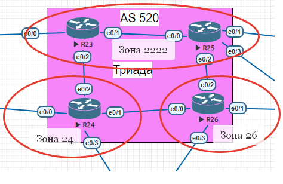
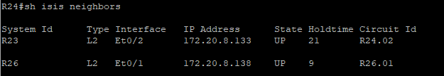
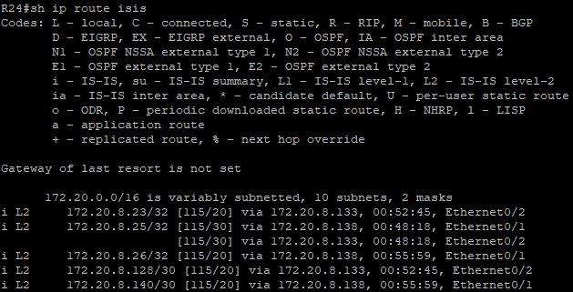
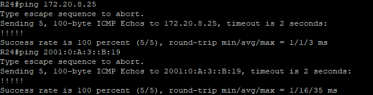

### IS-IS
Настроить IS-IS офисе Триада

#### Цель:

R23 и R25 находятся в зоне 2222.

R24 находится в зоне 24.

R26 находится в зоне 26.

Настройка осуществляется одновременно для IPv4 и IPv6.

На всех маршрутизаторах в Триаде нужно запустить ISIS

    router isis

Настроить Area согласно заданию
Пример для R23

    net 49.2222.0000.0000.0023.00

Где **49** - AFI (Authorty and Format Identifier), 49 означает локальный класс

**2222** - Area Id, на роутерах настраиваем согласно заданию  

**0000.0000.0023** - System ID, уникальный идентификатор, задаем номер роутера согласно схеме

**00** - выставляем в 00

На внутрених интрефейсах включаем IS-IS 

    ip router isis
    ipv6 router isis

После настройки можно проверить работу.

R24

    show ip isis neighbors

R24

    show ip route isis

Для теста пожно проверить дотсуность противополоного роутера через ICMP, для R24 это R25, пинговать будем Loopback

[Конфигурация оборудования](Config/).

