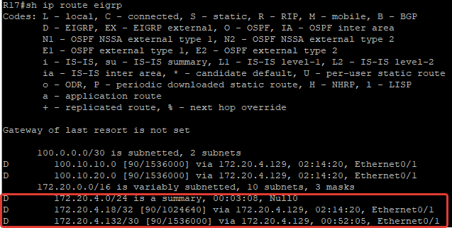
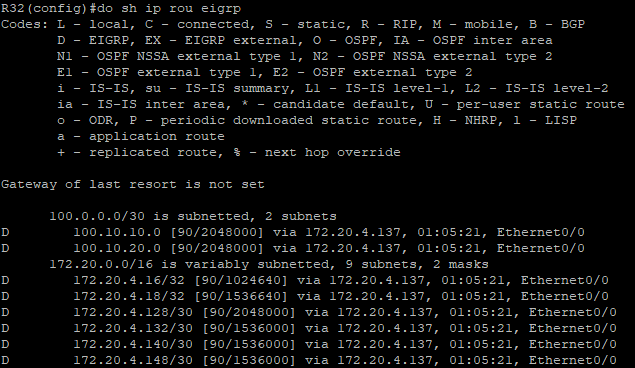
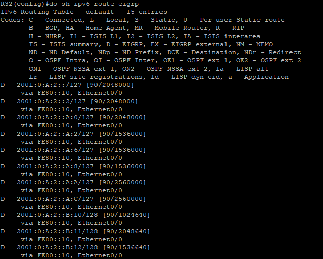
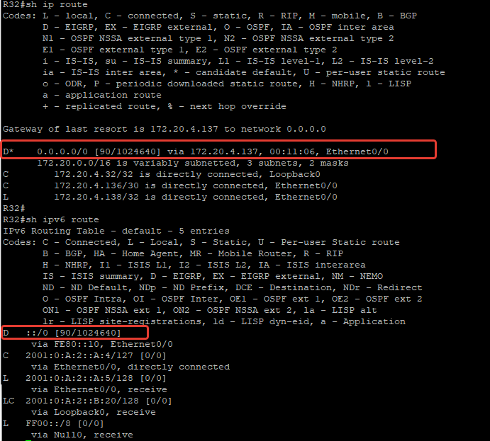

### EIGRP

#### Цель:

Настроить EIGRP в С.-Петербург;
Использовать named EIGRP

#### Описание/Пошаговая инструкция выполнения домашнего задания:
В офисе С.-Петербург настроить EIGRP.
R32 получает только маршрут по умолчанию.
R16-17 анонсируют только суммарные префиксы.
Использовать EIGRP named-mode для настройки сети.
Настройка осуществляется одновременно для IPv4 и IPv6.

#### Начало работ 

Для EIGRP будем использовать Named Mode, для включеия будем использовать команду

    router eigrp SPB

Для безопасности будем использовать аутентификацию

Для начала настроим ключи

    key chain SBP-EIGRP
     key 1
      key-string SBP$ecret

Также для безопасности по умолчанию будем отключать процесс EIGRP на все интерфесайх и вклчать там где требуется

Для Router-ID будем использовать адресс IPv4 Loopback роутера

Базовые настройки на всех роутерах, в [ ] нужно подставить нужные значения
Для IPv4 бд

    router eigrp SBP
     !
     address-family ipv6 unicast autonomous-system 6
      !
      af-interface default
      authentication mode md5
      authentication key-chain SPB-EIGRP
      passive-interface
     exit-af-interface
     !
     af-interface Ethernet[PortNumber]
      no passive-interface
     exit-af-interface
     !
     topology base
     exit-af-topology
     eigrp router-id [Router ipv4 looopback]
    exit-address-family
    !
    address-family ipv4 unicast autonomous-system 4
     !
     af-interface default
      authentication mode md5
      authentication key-chain SPB-EIGRP
      passive-interface
     exit-af-interface
     !
     af-interface Ethernet[PortNumber]
      no passive-interface
     exit-af-interface
     !
     topology base
     exit-af-topology
     network [Subnet]
     eigrp router-id [Router ipv4 looopback]
    exit-address-family

После настройки можно проверить работу можно командами

    show ip route eigrp
    show ipv6 route eigrp
или 

    show ip eigrp topology
    show ipv6 eigrp topology

Для суммаризации на R16 и R17 будем использовать команду 

    af-interface [PortNumber]
     summary-address 172.20.4.0 255.255.255.0

Проверяем через команду 

    show ip route eigrp

R32 должен получать только маршрут по умолчанию.

Проверим какие маргруты видны в таблице маргрутизации на R32

Аналочичная картина для IPv6

На R16 в сотрону R32 будем отправлять суммарный маршрут 

Для IPv4 - 0.0.0.0 0.0.0.0 

Для IPv6 - ::/0

    router eigrp SBP
     address-family ipv6 unicast autonomous-system 6 
       af-interface Ethernet0/3 
        summary-address ::/0
       exit-af-interface       
     exit-address-family
     
     address-family ipv4 unicast autonomous-system 4
      af-interface Ethernet0/3 
       summary-address 0.0.0.0 0.0.0.0
      exit-af-interface

Далее проверяем таблицу маршрутизации на R32 и видим что она заметно сократилась и осталась только суммарка

[Конфигурация оборудования](Config/).

