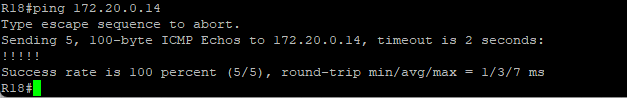
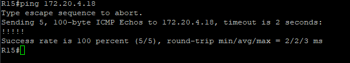
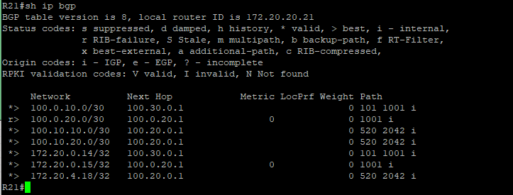

### BGP. Part 1.

#### Цель:

Настроите eBGP между офисом Москва и двумя провайдерами - Киторн и Ламас.

Настроите eBGP между провайдерами Киторн и Ламас.

Настроите eBGP между Ламас и Триада.

Настроите eBGP между офисом С.-Петербург и провайдером Триада.

Организуете IP доступность между пограничным роутерами офисами Москва и С.-Петербург.

#### Описание/Пошаговая инструкция выполнения домашнего задания:

#### Ниже приведена настройки роутеров для пунктов:

- Настроите eBGP между офисом Москва и двумя провайдерами - Киторн и Ламас.

- Настроите eBGP между провайдерами Киторн и Ламас.

- Настроите eBGP между Ламас и Триада.

- Настроите eBGP между офисом С.-Петербург и провайдером Триада.

R14

    router bgp 1001
     bgp router-id 172.20.0.14
     neighbor 100.0.10.2 remote-as 101

R15

    router bgp 1001
     bgp router-id 172.20.0.15
     neighbor 100.0.20.2 remote-as 301

R21

    router bgp 301
     bgp router-id 172.20.20.21    
     neighbor 100.0.20.1 remote-as 1001
     neighbor 100.20.0.1 remote-as 520
     neighbor 100.30.0.1 remote-as 101

R22

     router bgp 101
      bgp router-id 172.20.24.22      
      neighbor 100.0.10.1 remote-as 1001
      neighbor 100.30.0.2 remote-as 30
     
R24

    router bgp 101
     bgp router-id 172.20.24.22
     neighbor 100.0.10.1 remote-as 1001
     neighbor 100.30.0.2 remote-as 30

R18

     router bgp 2042
       bgp router-id 172.20.4.18
       neighbor 100.10.10.2 remote-as 520
       neighbor 100.10.20.2 remote-as 520

#### Организуете IP доступность между пограничным роутерами офисами Москва и С.-Петербург.

Для решения этого шага будем анонсировать Lo0 и стыковочные сети с провайдером офисов Москвы и СпБ

Для этого будем использовать команду

     network x.x.x.x mask x.x.x.x

Пример анонса сетей СпБ

     router bgp 2042
      network 100.10.10.0 mask 255.255.255.252
      network 100.10.20.0 mask 255.255.255.252
      network 172.20.4.18 mask 255.255.255.255
    
Для проверки будем использовать команду Ping

c R18 на R14

C R15 на R18 

На R21 можно посмотреть какие подсети есть в BGP

[Конфигурация оборудования](Config/).

