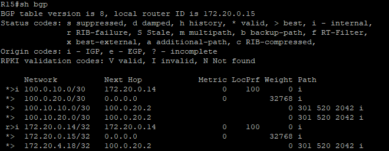
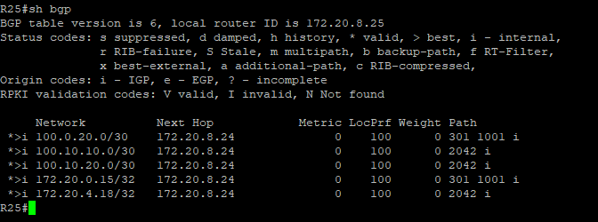
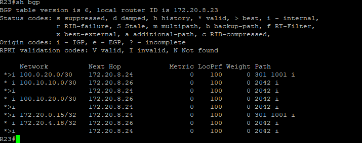
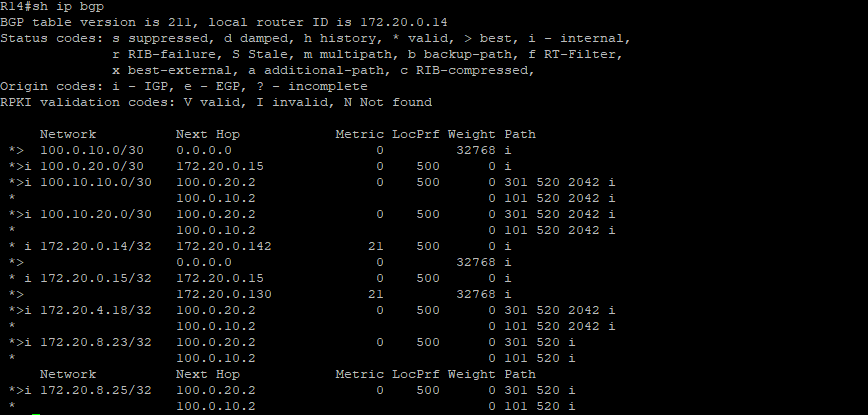
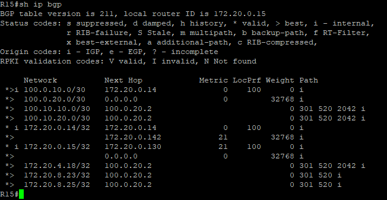
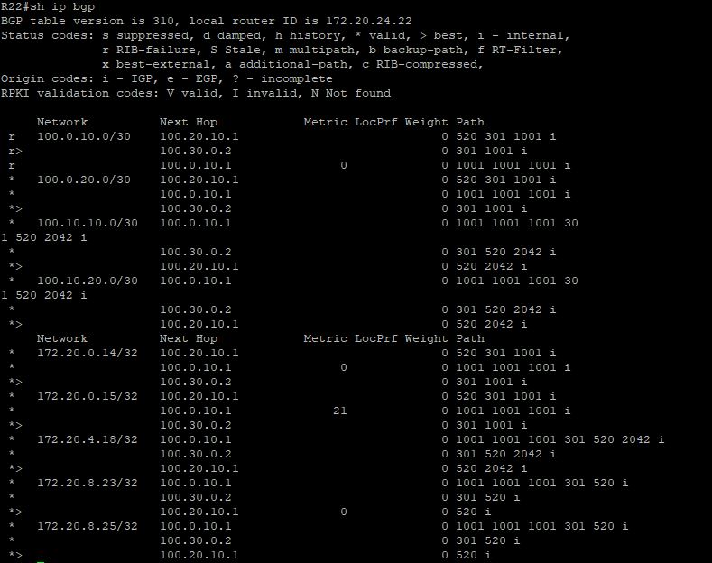
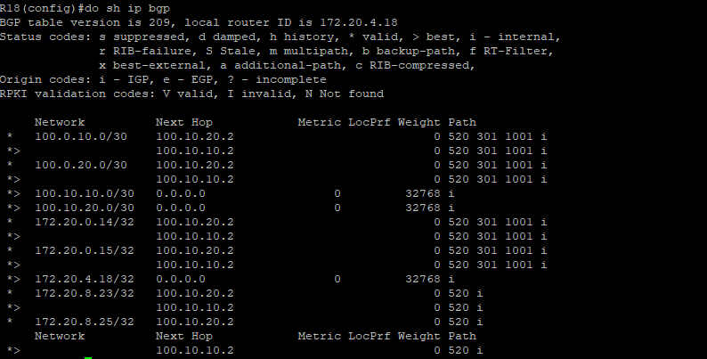
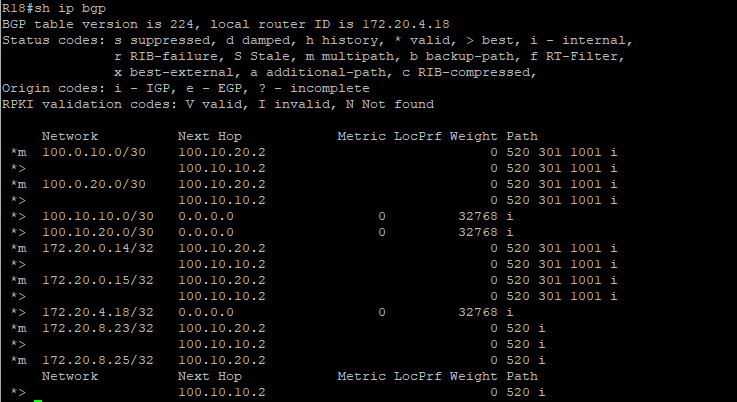
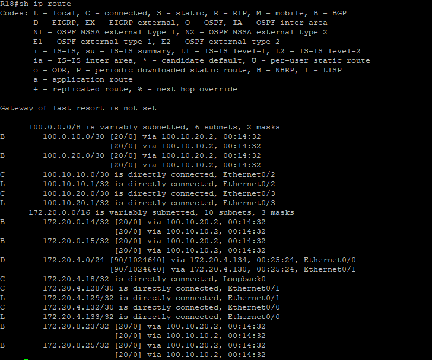

### BGP. Part 2

#### Цель:

Настроите iBGP в офисом Москва между маршрутизаторами R14 и R15.

Настроите iBGP в провайдере Триада, с использованием RR.

Настройте офиса Москва так, чтобы приоритетным провайдером стал Ламас.

Настройте офиса С.-Петербург так, чтобы трафик до любого офиса распределялся по двум линкам одновременно.

Все сети в лабораторной работе должны иметь IP связность.

#### Описание/Пошаговая инструкция выполнения домашнего задания:

#### Настроите iBGP в офисом Москва между маршрутизаторами R14 и R15.

На роутеры в Москве добавляем в BGP следующие стройки

R14

    router bgp 1001
          neighbor 172.20.0.15 remote-as 1001
          neighbor 172.20.0.15 update-source Loopback0

R15

    router bgp 1001
     neighbor 172.20.0.15 remote-as 1001
     neighbor 172.20.0.14 update-source Loopback0

Проверяем, нужно увидить маршруты помеченные буквой "i"

#### Настроите iBGP в провайдере Триада, с использованием RR.

Route Reflector будет R23, произведем настройку роутера

R23

    router bgp 520
      bgp router-id 172.20.8.23
      bgp log-neighbor-changes
      neighbor IBGP peer-group
      neighbor IBGP route-reflector-client
      neighbor IBGP remote-as 520
      neighbor 172.20.8.24 peer-group IBGP
      neighbor 172.20.8.25 peer-group IBGP
      neighbor 172.20.8.26 peer-group IBGP

На роутерах клиентах пропишем 

    neighbor 172.20.8.23 remote-as 520
    neighbor 172.20.8.23 update-source Loopback0
    neighbor 172.20.8.23 next-hop-self

Для решения проблемы с распространением анонсов и выбором их как best нужно на всех маршрутизаторах, кроме Route Reflector прописать  `next-hop-self`

Проверяем таблиу BGP на RR и любом 

#### Настройте офиса Москва так, чтобы приоритетным провайдером стал Ламас.

Для выполнеия этого шага, будем испольщовать Local Preference
По умолчания LP = 100, изменим LP на R15 до 200.

    router bgp 1001
     bgp default local-preference 500

Что бы входящий трафик так же шел через Ламас, будем использовать AS Prepend, на R14 создаем Route-map и применяем его на соседа Киторон

    route-map AS_PREPEND permit 10
     set as-path prepend 1001 1001
    
    router bgp 1001
     neighbor 100.0.10.2 route-map AS_PREPEND out

 Проверяем Local Preference и NextHop на R14 и R15

 

В Киторон на R22 нужно проверить что отработал AS prepend

 

#### Настройте офиса С.-Петербург так, чтобы трафик до любого офиса распределялся по двум линкам одновременно.

Смотрим таблицу маршрутизции BGP на R18 и видим один лучший маршрут

На R18 вводим команду

    router bgp 2042
     bgp bestpath as-path multipath-relax

В Show ip route тоже видим 2 пути на внешние маршруты

[Конфигурация оборудования](Config/).

