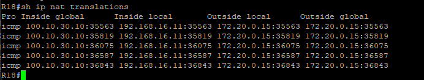

### Основные протоколы сети интернет 

#### Цель:

Цель:
Настроить DHCP в офисе Москва
Настроить синхронизацию времени в офисе Москва
Настроить NAT в офисе Москва, C.-Перетбруг и Чокурдах

#### Описание/Пошаговая инструкция выполнения домашнего задания:

- Настроите NAT(PAT) на R14 и R15. Трансляция должна осуществляться в адрес автономной системы AS1001.
- Настроите NAT(PAT) на R18. Трансляция должна осуществляться в пул из 5 адресов автономной системы AS2042.
- Настроите статический NAT для R20.
- Настроите NAT так, чтобы R19 был доступен с любого узла для удаленного управления.
 - * Настроите статический NAT(PAT) для офиса Чокурдах.
- Настроите для IPv4 DHCP сервер в офисе Москва на маршрутизаторах R12 и R13. VPC1 и VPC7 должны получать сетевые настройки по DHCP.
- Настроите NTP сервер на R12 и R13. Все устройства в офисе Москва должны синхронизировать время с R12 и R13.
- Все офисы в лабораторной работе должны иметь IP связность.
- План работы и изменения зафиксированы в документации.

#### Настроите NAT(PAT) на R14 и R15. Трансляция должна осуществляться в адрес автономной системы AS1001.

Для NAT мы будем использовать подсеть 100.0.30.0\24

Создадим пул для NAT и Aсcess List для все пользовательских сетей MSK 192.168.0.0\20 

Настройки будут следующие

     ip nat pool MSK-NAT-POOL1 100.0.30.10 100.0.30.100 netmask 255.255.255.0
     ip nat inside source list 1 pool MSK-NAT-POOL1 overload
     access-list 1 permit 192.168.0.0 0.0.15.255

На Интерфесах пограничных роутерах R14 и R15 выставлеяем настройки NAT: outside или inside

    interface Ethernet0/0
      ip nat inside
    interface Ethernet0/1
      ip nat inside
    interface Ethernet0/3
      ip nat inside
    nterface Ethernet0/2
      ip nat outside

И через BGP публикуем подсеть под NAT

    router bgp 1001
     network 100.0.30.0 mask 255.255.255.0

C VPC1 пропингуем SPB и проверим NAT через  show ip nat translation

#### Настроите NAT(PAT) на R18. Трансляция должна осуществляться в пул из 5 адресов автономной системы AS2042.

Настройки похожие на MSK, поэтому укажу только различия в конфиге

    ip nat pool SPB-NAT-POOL2 100.10.30.10 100.10.30.15 netmask 255.255.255.0
    ip nat inside source list 1 pool SPB-NAT-POOL2 overload

    access-list 1 permit 192.168.16.0 0.0.3.255

#### Настроите статический NAT для R20.

На пограничных маршрутизаторах нуно прописать static NAT

   ip nat inside source static 172.20.0.20 100.0.30.201

Проверяем с R20 с адреса lo0 который убрали за static NAT

На R15 проверям работу

#### Настроите NAT так, чтобы R19 был доступен с любого узла для удаленного управления.

Для тестирования включим Telten на R19 

    line vty 0 4
     password pass
     transport input telnet

Создаем Static NAT с пробросом порта TCP 23 на порт 2323

    ip nat inside source static tcp 172.20.0.19 23 100.0.30.202 2323 extendable

И проверям работу, проверять будем с R18 (СПБ)

   

#### Настроите для IPv4 DHCP сервер в офисе Москва на маршрутизаторах R12 и R13. VPC1 и VPC7 должны получать сетевые настройки по DHCP

т.к. DHCP Pool нужно создать на R12 и R13, а VLAN у нас терминируется на SW4 и SW5, то на свичах нужно создать DHCP Relay, для SW4 и Sw5 настройки идентичны

    interface Vlan100
     ip helper-address 172.20.0.12
     ip helper-address 172.20.0.13
    interface Vlan101
     ip helper-address 172.20.0.12
     ip helper-address 172.20.0.

На R12 и R13 нужно создать 2 DHCP пула, чтобы небыло конфликта, то разделим пул пополам

R12

    ip dhcp excluded-address 192.168.0.1
    ip dhcp excluded-address 192.168.1.1
    ip dhcp excluded-address 192.168.0.150 192.168.0.254
    ip dhcp excluded-address 192.168.1.150 192.168.1.254
    ip dhcp pool DHCP1
     network 192.168.0.0 255.255.255.0
     default-router 192.168.0.1
    ip dhcp pool DHCP2
     network 192.168.1.0 255.255.255.0
     default-router 192.168.1.1

R13

    ip dhcp excluded-address 192.168.0.1
    ip dhcp excluded-address 192.168.1.1
    ip dhcp excluded-address 192.168.0.2 192.168.0.151
    ip dhcp excluded-address 192.168.1.2 192.168.1.151
    ip dhcp pool DHCP1
     network 192.168.0.0 255.255.255.0
     default-router 192.168.0.1
    ip dhcp pool DHCP2
     network 192.168.1.0 255.255.255.0
     default-router 192.168.1.1

Далее на VPC1 нужно попробовать получить IP по DHCP

 

Ну и на роутере проверить выданные IP

 

#### Настроите NTP сервер на R12 и R13. Все устройства в офисе Москва должны синхронизировать время с R12 и R13.

На R12 и R13 вводим

    ntp master 2

На остальном оборудовании нужно ввести IP NTP серверов

    ntp server 172.20.0.12
    ntp server 172.20.0.13
    ntp update-calendar

Проверяем работу

 

[Конфигурация оборудования](Config/).

