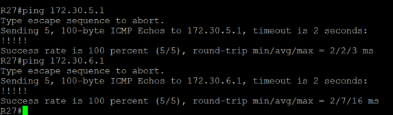

### Основные протоколы сети интернет 

#### Цель:

Цель:
- Настроите GRE между офисами Москва и С.-Петербург.
- Настроите DMVMN между Москва и Чокурдах, Лабытнанги.
- Все узлы в офисах в лабораторной работе должны иметь IP связность.
- План работы и изменения зафиксированы в документации.

#### Описание/Пошаговая инструкция выполнения домашнего задания:

#### Настроите GRE между офисами Москва и С.-Петербург.

Нужно создать тунели на R14, R15 и R18

R14

    interface Tunnel11
     ip address 172.30.0.5 255.255.255.252
     ip mtu 1400
     ip tcp adjust-mss 1360
     tunnel source 100.0.10.1
     tunnel destination 100.10.20.1

R15

    interface Tunnel10
     ip address 172.30.0.1 255.255.255.252
     ip mtu 1400
     ip tcp adjust-mss 1360
     tunnel source 100.0.20.1
     tunnel destination 100.10.10.1

R18

    interface Tunnel10
     ip address 172.30.0.2 255.255.255.252
     ip mtu 1400
     ip tcp adjust-mss 1360
     tunnel source 100.10.10.1
     tunnel destination 100.0.20.1
    !
    interface Tunnel11
     ip address 172.30.0.6 255.255.255.252
     ip mtu 1400
     ip tcp adjust-mss 1360
     tunnel source 100.10.20.1
     tunnel destination 100.0.10.1

Проверяем что инетрфейсы понялиси и проверяем доступность через Ping

#### Настроите DMVMN между Москва и Чокурдах, Лабытнанги.

Москва будет выступать как **Hub**, Чокурдах, Лабытнанги в качестве **Spoke**

R15

    interface Tunnel0
     description DMVPN
     ip address 172.30.5.1 255.255.255.0
     no ip redirects
     ip mtu 1400
     ip nhrp map multicast dynamic
     ip nhrp network-id 1
     ip tcp adjust-mss 1360
     tunnel source 100.0.20.1
     tunnel mode gre multipoint
     tunnel key 1

R14

    interface Tunnel1
     description DMVPN
     ip address 172.30.6.1 255.255.255.0
     no ip redirects
     ip mtu 1400
     ip nhrp map multicast dynamic
     ip nhrp network-id 11
     ip tcp adjust-mss 1360
     tunnel source 100.0.10.1
     tunnel mode gre multipoint
     tunnel key 11

Приступаем к настройке **SPOKE**

R27

    interface Tunnel0
     ip address 172.30.5.2 255.255.255.0
     no ip redirects
     ip mtu 1400
     ip nhrp map multicast 100.0.20.1
     ip nhrp map 172.30.5.1 100.0.20.1
     ip nhrp network-id 1
     ip nhrp nhs 172.30.5.1
     ip tcp adjust-mss 1360
     tunnel source 100.20.20.2
     tunnel mode gre multipoint
     tunnel key 1
    !
    interface Tunnel1
     ip address 172.30.6.2 255.255.255.0
     no ip redirects
     ip mtu 1400
     ip nhrp map multicast 100.0.10.1
     ip nhrp map 172.30.6.1 100.0.10.1
     ip nhrp network-id 11
     ip nhrp nhs 172.30.6.1
     ip tcp adjust-mss 1360
     tunnel source 100.20.20.2
     tunnel mode gre multipoint
     tunnel key 11

R28, т.к. у нас есть 2 стыка подключения к Триаде, то каждый тунель насроим на разные интерфейсы.

    interface Tunnel0
     ip address 172.30.5.3 255.255.255.0
     no ip redirects
     ip mtu 1400
     ip nhrp map multicast 100.0.20.1
     ip nhrp map 172.30.5.1 100.0.20.1
     ip nhrp network-id 1
     ip nhrp nhs 172.30.5.1
     ip tcp adjust-mss 1360
     tunnel source 100.20.40.2
     tunnel mode gre multipoint
     tunnel key 1
    !
    interface Tunnel1
    ip address 172.30.6.3 255.255.255.0
    no ip redirects
    ip mtu 1400
    ip nhrp map multicast 100.0.10.1
    ip nhrp map 172.30.6.1 100.0.10.1
    ip nhrp network-id 11
    ip nhrp nhs 172.30.6.1
    ip tcp adjust-mss 1360
    tunnel source 100.20.30.2
    tunnel mode gre multipoint
    tunnel key 11

Проверяем доступность тунельных IP

[Конфигурация оборудования](Config/).
