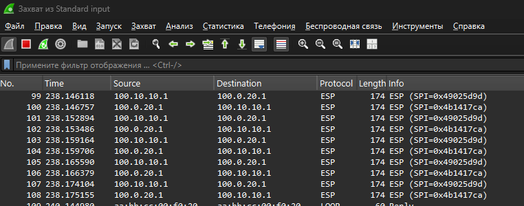
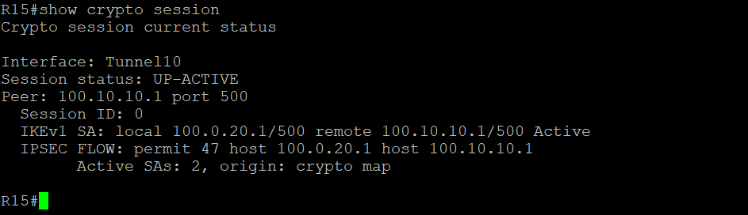
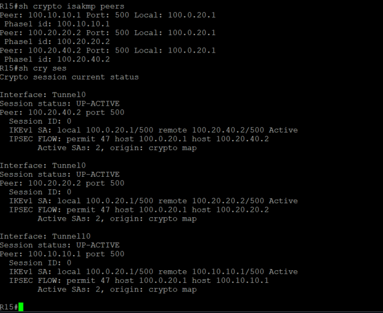

### Основные протоколы сети интернет 

#### Цель:

- Настроить GRE поверх IPSec между офисами Москва и С.-Петербург
- Настроить DMVPN поверх IPSec между офисами Москва и Чокурдах, Лабытнанги

#### Описание/Пошаговая инструкция выполнения домашнего задания:

- Настроите GRE поверх IPSec между офисами Москва и С.-Петербург.
- Настроите DMVPN поверх IPSec между Москва и Чокурдах, Лабытнанги.
- Все узлы в офисах в лабораторной работе должны иметь IP связность.
- План работы и изменения зафиксированы в документации.

#### Описание/Пошаговая инструкция выполнения домашнего задания:
#### Настроить GRE поверх IPSec между офисами Москва и С.-Петербург

В СПБ есть 2 GRE тунеля, поверх прикрутим IPSec

R15
    
    crypto isakmp policy 10
     encr aes
     authentication pre-share
     group 2
     crypto isakmp key Otus! address 100.10.10.1    
        
    crypto ipsec transform-set GRE-IPSEC esp-3des esp-sha-hmac 
     mode transport

    crypto ipsec profile PROTECT-GRE
     set transform-set GRE-IPSEC 

    interface Tunnel10
      tunnel protection ipsec profile PROTECT-GRE
R18
  
    crypto isakmp policy 10
     encr aes
     authentication pre-share
     group 2
     crypto isakmp key Otus! address 100.0.20.1    
        
    crypto ipsec transform-set GRE-IPSEC esp-3des esp-sha-hmac 
     mode transport

    crypto ipsec profile PROTECT-GRE
     set transform-set GRE-IPSEC 

    interface Tunnel10
      tunnel protection ipsec profile PROTECT-GRE

Проверяем что тунель понялся, и через whireshark проверить что мы ping зашифрован

Для R14 и R18 настраивается аналогично.

#### Настроить DMVPN поверх IPSec между офисами Москва и Чокурдах, Лабытнанги

Для R28 и 27 настраиваются по аналогии. На R14 и R15  нужно добавить строку с адресом R28 и R27 в политику.

Пример настройки R27

    crypto isakmp policy 10
     encr aes
     authentication pre-share
     group 2
    crypto isakmp key Otus! address 100.0.10.1
    crypto isakmp key Otus! address 100.0.20.1
     
    crypto ipsec transform-set GRE-IPSEC esp-3des esp-sha-hmac
     mode transport

    crypto ipsec profile PROTECT-GRE
    set transform-set GRE-IPSEC

Ну и финально проверяем что тунели установились

[Конфигурация оборудования](Config/).
